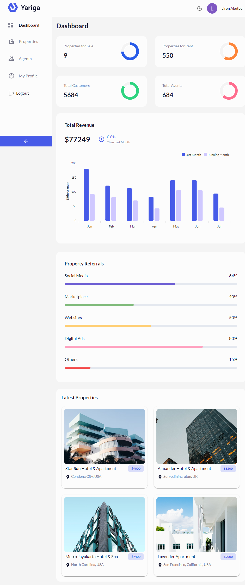
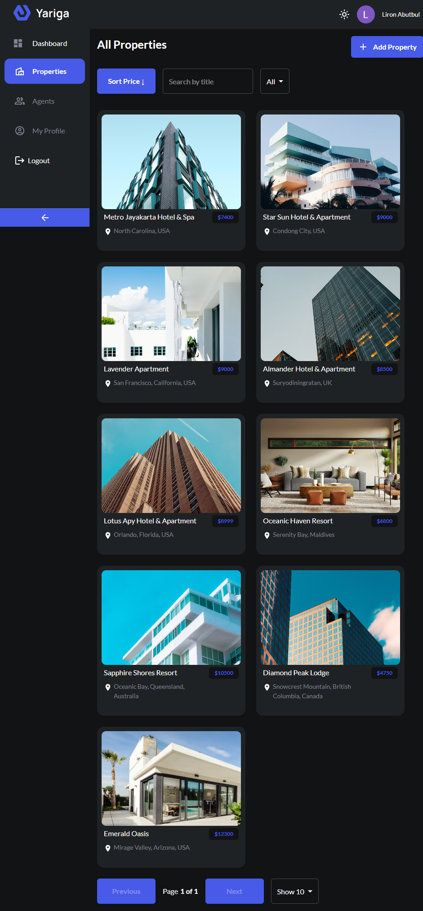
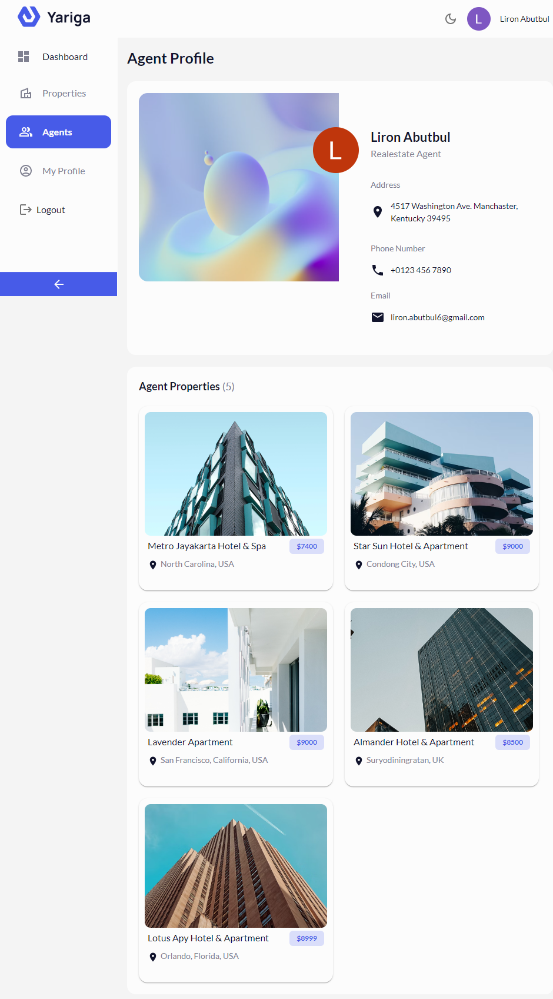

<a name="readme-top"></a>
<div align="center">

  
  

  
  

  <p>
  <b>Yariga</b> is a Full Stack MERN Dashboard App With CRUD, Auth, and Charts Using Refine
  </p>
  
<!-- Badges -->
<p>
  <a href="https://github.com/ladunjexa/Yariga-Realestate-Dashboard/graphs/contributors">
    
  </a>
  <a href="">
    
  </a>
  <a href="https://github.com/ladunjexa/Yariga-Realestate-Dashboard/network/members">
    
  </a>
  <a href="https://github.com/ladunjexa/Yariga-Realestate-Dashboard/stargazers">
    
  </a>
  <a href="https://github.com/ladunjexa/Yariga-Realestate-Dashboard/issues/">
    
  </a>
  <a href="https://github.com/ladunjexa/Yariga-Realestate-Dashboard/blob/master/LICENSE">
    
  </a>
</p>
   
 <h4>
    <a href="https://mern-dashboard-app.vercel.app/">View Demo</a>
  <span> · </span>
    <a href="https://github.com/ladunjexa/Yariga-Realestate-Dashboard">Documentation</a>
  <span> · </span>
    <a href="https://github.com/ladunjexa/Yariga-Realestate-Dashboard/issues/">Report Bug</a>
  <span> · </span>
    <a href="https://github.com/ladunjexa/Yariga-Realestate-Dashboard/issues/">Request Feature</a>
  </h4>
</div>

<br />

<!-- Table of Contents -->
<details>

<summary>

# :notebook_with_decorative_cover: Table of Contents

</summary>

- [About the Project](#star2-about-the-project)
  * [Folder Structure](#bangbang-folder-structure)
  * [Environment Variables](#key-environment-variables)
  * [Tech Stack](#space_invader-tech-stack)
- [Getting Started](#toolbox-getting-started)
  * [Installation](#gear-installation)
  * [Run Locally](#running-run-locally)
- [Media](#milky_way-media)
- [Contributing](#wave-contributing)
- [License](#warning-license)
- [Contact](#handshake-contact)
- [Acknowledgements](#gem-acknowledgements)

</details>  

<!-- About the Project -->
## :star2: About the Project

<p align="center"> 
  
</div>
<br />
 
<!-- Folder Structure -->
### :bangbang: Folder Structure

<b>Yariga</b> code folder structure seperated to client-side and server-side.
```bash
Yariga-Realestate-Dashboard/
|- client
  |-- src/
    |-- assets/
    |-- components/
      |-- agent/
      |-- charts/
      |-- common/
      |-- home/
      |-- layout/
    |-- constants/
    |-- contexts/
    |-- interfaces/
    |-- pages/
    |-- utils/
    |-- App.tsx
  |-- .env
|- server
  |-- controllers/
  |-- mongodb/
  |-- routes/
  |-- index.js
  |-- .env
```

Now, lets dive into both server and client sides folders.

### CLIENT-SIDE

#### components

`agent/` - `charts/` - `common/` - `home/` - `layout/`

This folder contains all the function components arranged in subfolders, which they're independent and reusable bits of code. They serve the UI (User Interface) of Yariga to avoid unnecessary repetition of the code. those components are beautiful customized widgets using MUI to describe initial theme for widgets as they're named.

#### constants

`index.ts`

This is a JavaScript code that defines an array of objects named propertyReferralsInfo. Each object represents a source of referral for a property (like a real estate property). The array contains five objects representing five different referral sources: Social Media, Marketplace, Websites, Digital Ads, and Others. Each object specifies the percentage of referrals that come from the respective source and a unique color that represents the referral source.

#### interfaces

`agent.d.ts` - `common.d.ts` - `google.d.ts` - `home.d.ts` - `property.d.ts` - `theme.d.ts`

In the context of Refine, the `interfaces` directory is used to store TypeScript interfaces that define the types of data used in the application. This is useful for providing type information to the TypeScript compiler, which can then perform type-checking and provide better autocompletion and error messages.

The `interfaces` directory typically contains one or more `.ts` files, each of which exports one or more interfaces that describe the shape of the data used in the application. For example, if an application uses data from an external API, it might define an interface that describes the structure of the API response.

By storing interfaces in a separate directory, the codebase becomes more organized and easier to maintain. It also encourages good coding practices by making it easier to define and enforce types throughout the application.

#### pages

`agent-profile.tsx` - `agent.tsx` - `all-properties.tsx` - `create-property.tsx` - `edit-property.tsx` - `home.tsx` - `login.tsx` - `my-profile.tsx` - `property-details.tsx` - `index.ts`

In Refine, the pages directory is used to store the React components that correspond to the different pages of the application. These components typically use Refine's built-in components and hooks to provide a complete user interface for interacting with the data in the application.

#### utils

`parse-jwt.ts`

```ts
export function parseJwt(token: string): UserPayload {
  const base64Url = token.split(".")[1];
  const base64 = base64Url.replace(/-/g, "+").replace(/_/g, "/");
  const jsonPayload = decodeURIComponent(
    window
      .atob(base64)
      .split("")
      .map(function (c) {
        return "%" + ("00" + c.charCodeAt(0).toString(16)).slice(-2);
      })
      .join("")
  );

  return JSON.parse(jsonPayload);
}
```

This code defines a function named `parseJwt` that takes in a JWT (JSON Web Token) string and returns the decoded payload as an object of type `UserPayload`, which is imported from an external file called `google.ts` in the `interfaces` directory.

Inside the `parseJwt` function, the JWT is split into its three components: header, payload, and signature. The payload is extracted and decoded from base64 to JSON format. The resulting JSON string is then parsed into a JavaScript object with the properties defined in `UserPayload` type.

In summary, this function is used to decode a JWT and extract the payload information as an object that can be used in a web application.

`validateForm.ts`

This code exports two utility functions:

1. `validateForm` function takes in an object of form values and validates them to check if any of the required fields are missing. It iterates through each field in the `formValues` object and checks if it is empty. If any required field is empty, it sets `hasError` flag to true and returns an error message in the `errors` object. If all fields are filled, it sets the `hasError` flag to false and returns the empty `errors` object.
2. `hasChanged` function takes in two objects `initialValues` and `currentValues`, representing the initial values of the form fields and the current values of the form fields respectively. It iterates through each field in the `initialValues` object and checks if the corresponding field in the `currentValues` object has been changed. If any field has been changed, it returns `true`. If all fields are unchanged, it returns `false`.

Both of these utility functions can be used to simplify the process of validating and handling form submissions in a React application.

#### contexts

```js
index.ts
```

This is a React code that defines a context provider component named `ColorModeContextProvider` to handle the color mode of a theme used in a React application. The purpose of this component is to provide the theme color mode (either light or dark) and allow the user to switch between them.

The component uses the `createContext` function from React to create a context object named `ColorModeContext`, which will be used to share the state between the components in the React component tree.

The `ColorModeContextProvider` component receives a `PropsWithChildren` type as a prop, which allows the component to receive and render children components.

The component uses `useState` hook to manage the state of the color mode. The `localStorage` is used to store the color mode value to persist the user's preference when the application is closed or reloaded.

The useEffect hook is used to update the localStorage with the new color mode value whenever the mode state value changes.

The component also checks for the user's system color preference using `window?.matchMedia("(prefers-color-scheme: dark)").matches` and sets the `systemPreference` value accordingly.

The `setColorMode` function is used to switch the color mode between "light" and "dark" based on the current mode state value.

Finally, the `ColorModeContext.Provider` component wraps the `ThemeProvider` component from `@pankod/refine-mui` and provides the mode and `setColorMode` values as context values to its children. The `ThemeProvider` component provides a custom theme based on the current color mode value.

```js
theme.ts
```

This code defines two custom theme objects named `overridedLightTheme` and `overridedDarkTheme`. These custom themes are based on the default themes provided by the `@pankod/refine-mui` package, which is a library for customizing Material UI components in React applications.

The `overridedLightTheme` object is a modified version of the `LightTheme` provided by `@pankod/refine-mui`. It overrides some of the default values of the `palette` object in the theme to customize the color scheme of the theme. For example, it changes the primary color to a light gray color with a dark blue hue for its dark shade, and the secondary color to a light gray color with white text.

The `overridedDarkTheme` object is a modified version of the `DarkTheme` provided by `@pankod/refine-mui`. It overrides some of the default values of the `palette` object to customize the color scheme of the theme for the dark mode. For example, it changes the primary color to a dark blue color, the secondary color to a dark gray color with white text, and the background color to a dark shade of gray.

Both `overridedLightTheme` and `overridedDarkTheme` objects are exported for use in other parts of the application. These custom themes can be passed as props to the `ThemeProvider` component from `@pankod/refine-mui` to customize the color scheme of the Material UI components used in the React application.

### SERVER-SIDE

#### controllers

`property.controller.js` - `user.controller.js`

In a Refine app, the `controllers` folder is used to define the functions that handle incoming HTTP requests and generate HTTP responses. Each file in the `controllers` folder typically represents a logical entity or resource in the application, and defines functions that handle different HTTP methods (e.g. GET, POST, PUT, DELETE) for that entity.

The purpose of the `controllers` is to encapsulate the business logic and data manipulation for the different HTTP requests that the application handles. The controller functions typically take the request object as input, extract any necessary data from the request (e.g. query parameters, request body), and perform the necessary operations on the data (e.g. reading from or writing to the database). The functions then generate an appropriate HTTP response (e.g. a JSON object, an HTTP status code) and send it back to the client.

#### mongodb

`models/` - `connect.js`

In a Refine app, the `mongodb` folder is used to define and manage the connection to a MongoDB database. This folder contains a `connect.js` file that exports a function for establishing a connection to a MongoDB database using the Mongoose library.

the `models` folder in the MongoDB directory is used to define Mongoose models for MongoDB collections. A Mongoose model is a wrapper around a MongoDB collection that provides a way to interact with the data in that collection in a more structured and convenient way.

#### routes

`property.route.js` - `user.route.js`

In a Refine app, the `routes` folder is used to define the API endpoints or routes that the server will respond to. Each file in the routes folder typically represents a resource or a set of related endpoints for a particular domain of the application.

The routes are defined using the Express.js routing API, which maps HTTP methods (GET, POST, PUT, DELETE, etc.) to specific URL paths and controller functions that handle the request and response. In addition to defining the routes themselves, the files in the `routes` folder might also define any middleware or validation logic that needs to be applied to the requests.

Overall, the `routes` folder in a Refine app plays an important role in defining the API endpoints that the app exposes to clients, and organizing the code for handling those endpoints in a logical and maintainable way.

#### index.js

This is a Node.js server application using the Express framework that provides APIs for managing users and properties. It uses MongoDB as the database and the `connectDB` function connects to the database using the URL specified in the `.env` file. The server listens on port 8080 and responds with a message "Hello from Yagira!" when the root URL is accessed. The `cors` middleware is used to allow cross-origin resource sharing, and `express.json` middleware is used to parse JSON requests. The `userRouter` and `propertyRouter` handle requests for user and property management respectively. Overall, this code sets up a server that provides APIs for managing users and properties with MongoDB as the database.

<!-- ENV VARIABLES -->
### :key: Environment Variables

In order to use Yariga you have to add the following environment variable to your .env file

```env
REACT_APP_GOOGLE_CLIENT_ID=<GOOGLE_CLIENT_ID>
REACT_APP_GOOGLE_CLIENT_SECRET=<GOOGLE_CLIENT_SECRET>
REACT_APP_SERVER_URL=<SERVER_URL>
```

```env
MONGODB_URL=<MONGODB_URL>
CLOUDINARY_CLOUD_NAME=<CLOUD_NAME>
CLOUDINARY_API_KEY=<API_KEY>
CLOUDINARY_API_SECRET=<API_SECRET>
```

<!-- TechStack -->
### :space_invader: Tech Stack

[](https://skillicons.dev)


<p align="right">(<a href="#readme-top">back to top</a>)</p>

<!-- Getting Started -->
## 	:toolbox: Getting Started

<!-- Installation -->
### :gear: Installation & Run Locally

#### Step 0:

Note :bangbang: the application uses a MongoDB database, therefore, you need to create a database and connect it to the application, for this, change the `MONGODB_URL` environment variable in `.env` file located in `server` folder.

Note :bangbang: the application uses a Cloudinary Cloud, therefore, you need to create Cloudinary account [here](https://cloudinary.com/) and change the `CLOUDINARY_CLOUD_NAME`,`CLOUDINARY_CLOUD_API_KEY` & `CLOUDINARY_API_SECRET` environment variables in `.env` file located in `server` folder.

Note :bangbang: the application uses a `Google Auth`, to add `Google sign-in` into Yariga site and save time your customers, Google sign-in allows login through Google in one click. therefore, before you can integrate `Google sign-in`, you need to create a `Google Client ID` and `Google Client Secret`. explore how-to tutorial [here](https://www.askdata.com/docs/dataset-google-analytics-how-to-get-google-client-id-and-client-secret). then, change the `REACT_APP_GOOGLE_CLIENT_ID` & `REACT_APP_GOOGLE_CLIENT_SECRET` environment variables in `.env` file located in `client` server.

Note :bangbang: Node.js server application (`index.js` file located in `server` folder) configuring a Node.js web server to listen for incoming HTTP requests on port `8080`.
reference:
```js
const startServer = async () => {
  try {
    connectDB(process.env.MONGODB_URL);
    app.listen(8080, () => console.log("Server started on port 8080"));
  } catch (error) {
    console.log(error);
  }
};
```
After following all the instructions above, we'll want to set one last environment variable `REACT_APP_SERVER_URL` in `.env` file located in `client` server.
as adapteed to the code, the value of the variable should be
```bash
http://localhost:8080/api/v1
```

#### Step 1:
Download or clone this repo by using the link below:

```bash
 https://github.com/ladunjexa/Yariga-Realestate-Dashboard
```

#### Step 2:

Yariga using NPM (Node Package Manager), therefore, make sure that Node.js is installed by execute the following command in consle

```bash
  node -v
```

### Step 3:

Go to root folder and execute the following command in console to get nodemon command line tool: (helps with the speedy development of Node. js applications)

```bash
  npm install -g nodemon
```

### Step 4:

In both folders (`client` / `server`) execute the following command to get the required packages:

```bash
  npm install
```

### Step 5:

Go to `server` folder and execute the following command in order to run our back-end server:

```bash
  npm start
```

### Step 6:

Go to `client` folder and execute the following command in order to run our front-end app:

```bash
  npm run dev
```

<p align="right">(<a href="#readme-top">back to top</a>)</p>

<!-- Media -->
## :milky_way: Media

### Dashboard Scene



### Properties Scene



### Agent Profile Scene



<p align="right">(<a href="#readme-top">back to top</a>)</p>

<!-- Contributing -->
## :wave: Contributing

Contributions are always welcome!

See [`contributing.md`](https://contributing.md/) for ways to get started.

Contributions are what make the open source community such an amazing place to learn, inspire, and create. Any contributions you make are **greatly appreciated**.

If you have a suggestion that would make this better, please fork the repo and create a pull request. You can also simply open an issue with the tag "enhancement".
Don't forget to give the project a star! Thanks again!

1. Fork the Project
2. Create your Feature Branch (`git checkout -b feature/AmazingFeature`)
3. Commit your Changes (`git commit -m 'Add some AmazingFeature'`)
4. Push to the Branch (`git push origin feature/AmazingFeature`)
5. Open a Pull Request

<p align="right">(<a href="#readme-top">back to top</a>)</p>

<!-- License -->
## :warning: License

Distributed under the MIT License. See [LICENSE.txt](https://github.com/ladunjexa/Yariga-Realestate-Dashboard/blob/main/LICENSE) for more information.

<p align="right">(<a href="#readme-top">back to top</a>)</p>

<!-- Contact -->
## :handshake: Contact

Esidene Alicha - Project Link: [https://github.com/dene009/YarigaEstateManager.git]

<!-- Acknowledgments -->
## :gem: Acknowledgements

This section used to mention useful resources and libraries (packages) that used in Yariga application project.

#### SERVER DEPENDENCIES:

 - [Node.js](https://nodejs.org/en/download/)
 - [Cloudinary](https://cloudinary.com/)
 - [CORS](https://developer.mozilla.org/en-US/docs/Web/HTTP/CORS)
 - [dotenv](https://www.npmjs.com/package/dotenv)
 - [Express.js](https://expressjs.com/)
 - [MongoDB](https://www.mongodb.com/)
 - [Mongoose](https://mongoosejs.com/)
 - [Nodemon](https://www.npmjs.com/package/nodemon)
 
#### CLIENT DEPENDENCIES:

 - [TypeScript](https://www.typescriptlang.org/)
 - [Refine Dev](https://refine.dev/)
 - [axios](https://axios-http.com/docs/intro)
 - [React](https://reactjs.org/)
 - [React-ApexChart](https://apexcharts.com/docs/react-charts/)
 - [React Loader Spinner](https://www.npmjs.com/package/react-loader-spinner)
 - [Material UI](https://mui.com/material-ui/getting-started/installation/)
 - [Google Fonts](https://fonts.google.com/)
- [Google Console](https://console.cloud.google.com/)
- [Figma Design](https://www.figma.com/file/QLU3mZJOsmnAN4SEQ8YSTA/Real-Estate-Admin-Dashboard?node-id=0%3A1&t=y5pLesuNGm7UIfPg-0)

<p align="right">(<a href="#readme-top">back to top</a>)</p>
